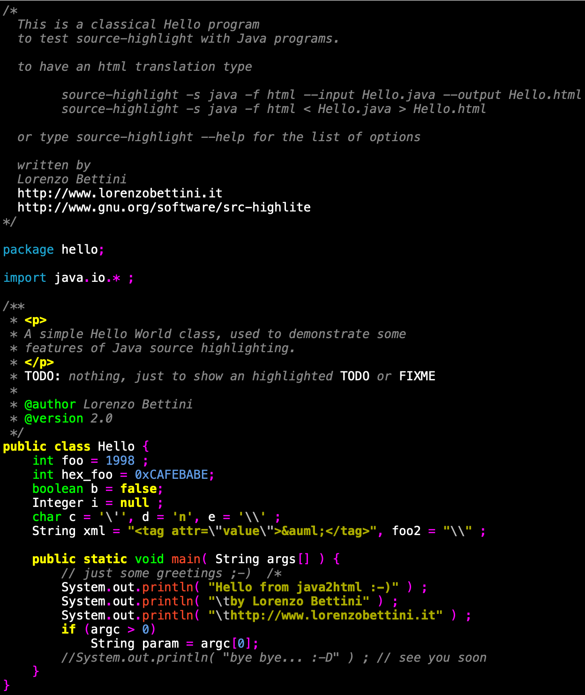

# syntaxer

Multi-backend syntax highlighter for Crystal



## Installation

1. Add the dependency to your `shard.yml`:

   ```yaml
   dependencies:
     syntaxer:
       github: mishushakov/syntaxer
   ```

2. Run `shards install`
3. Install highlighting backend(s)
    - `SourceHighlight` requires [source-highlight](https://www.gnu.org/software/src-highlite)
    - `Highlight` requires [highlight](https://gitlab.com/saalen/highlight)

## Usage

```crystal
require "syntaxer"
```

### `SourceHighlight`:

#### Options

```crystal
def self.highlight(code : String, lang : String, theme : String = "default.css", format : String = "html")
```

#### Example

```crystal
Syntaxer::SourceHighlight.highlight(code: "print 'hello world'", lang: "python")
```

**Output**

```html
<!-- Generator: GNU source-highlight 3.1.9
by Lorenzo Bettini
http://www.lorenzobettini.it
http://www.gnu.org/software/src-highlite -->
<pre><tt><font color="#ffff60">print</font><font color="#C7C7C7"> </font><font color="#ffa0a0">'hello world'</font></tt></pre>
```

**Preview**

<pre><tt><font color="#ffff60">print</font><font color="#C7C7C7"> </font><font color="#ffa0a0">'hello world'</font></tt></pre>

### `Highlight`

#### Options

```crystal
def self.highlight(code : String, lang : String, theme : String = "base16/monokai", inline_style : Bool = true, format : String = "html", wrap_pre : Bool = true)
```

#### Example

```crystal
Syntaxer::Highlight.highlight(code: "print 'hello world'", lang: "python")
```

**Output**

```html
<pre style="color:#f8f8f2; background-color:#272822; font-size:10pt; font-family:'Courier New',monospace;white-space: pre-wrap;"><span style="color:#ae81ff; font-weight:bold">print</span> <span style="color:#a6e22e">&#39;hello world&#39;</span>
</pre>
```

**Preview**

<pre style="color:#f8f8f2; background-color:#272822; font-size:10pt; font-family:'Courier New',monospace;white-space: pre-wrap;"><span style="color:#ae81ff; font-weight:bold">print</span> <span style="color:#a6e22e">&#39;hello world&#39;</span>
</pre>

## Development

TODO: Write development instructions here

## Contributing

1. Fork it (https://github.com/mishushakov/syntaxer/fork)
2. Create your feature branch (`git checkout -b my-new-feature`)
3. Commit your changes (`git commit -am 'Add some feature'`)
4. Push to the branch (`git push origin my-new-feature`)
5. Create a new Pull Request

## Contributors

- [Mish Ushakov](https://github.com/mishushakov) - creator and maintainer
